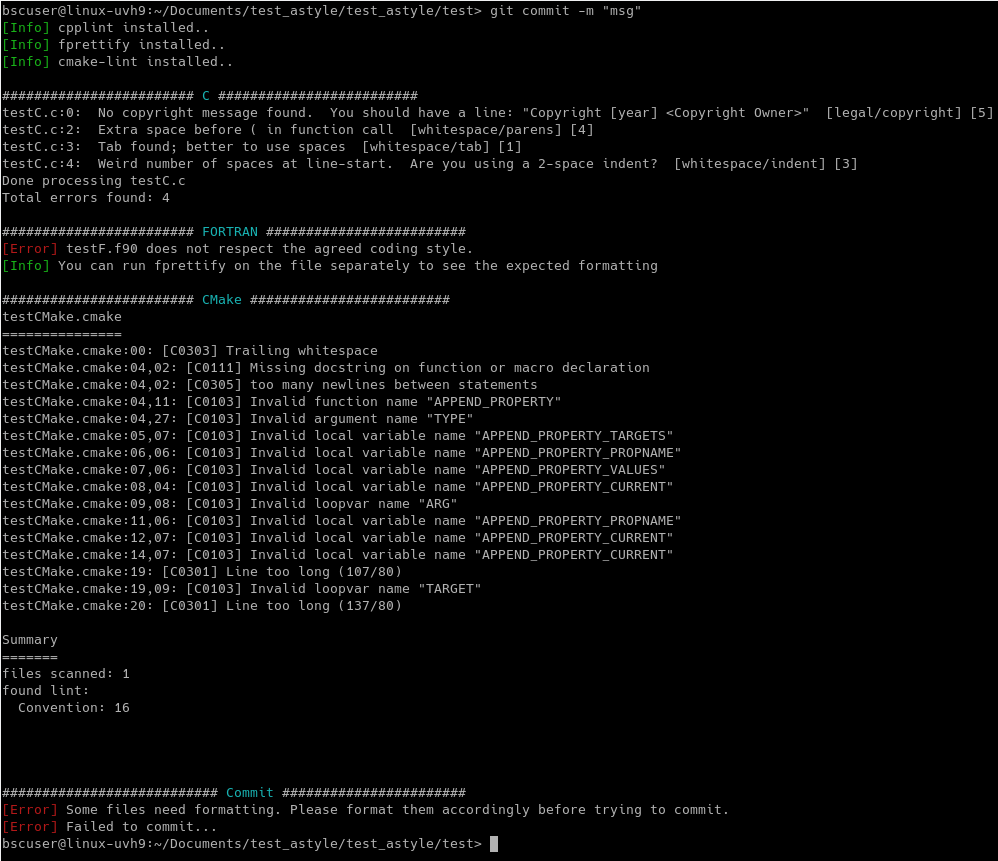

.. Fault Tolerance Library documentation Code Formatting file
.. _codeformatting:

Code Formatting 
======================

Code Checkers
----------------------

To enhance the code quality of FTI, we use the following open source code checkers:

.. list-table::
   :header-rows: 1

   * - Language
     - Code Checker
   * - C
     - cpplint_
   * - Fortran
     - fprettify_
   * - CMake
     - cmakelint_

.. _cpplint: https://github.com/cpplint/cpplint
.. _fprettify: https://github.com/pseewald/fprettify
.. _cmakelint: https://github.com/cheshirekow/cmake_format

Coding Style
-----------------------

cpplint checks C/C++ files style issues following googlecppstyle_. 

Fortran's and CMake style checkers have a plenty of formatting options, as their websites lists. For FTI, we choose to adopt the following style rules: 

**Table for formatting options per lang**

.. _googlecppstyle: http://google.github.io/styleguide/cppguide.html

**Examples**

Implementation
----------------------

Code checking is integrated in FTI through a script that traverses any added/modified code in FTI and checks if it conforms to the desired coding style. The script acts as a pre-commit hook that gets fired by a local commit. 

Examples of the execution on FTI s code

Contributing
----------------------

**Prerequisites**

Before you will be able to contribute to FTI, you need to have the code checkers installed so that your code is checked prior to any commit.
The checkers are easy to install if you have pip. For the latest installation steps, please visit the :ref:`Code Checkers`. 

..

	To make use of the pre-commit hook, after cloning the repository, one should initialize their branch through ``git init`` command.

..

	This should port the pre-commit hook, along with the default git hooks, to your ``GIT_DIR``

.. note::
	Notice: For a temporary commit where the developer is aware that the code might still need formatting but still wants to commit, use the flag **--no-verify**
