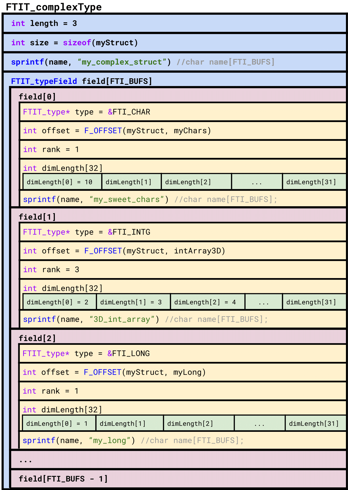

.. Fault Tolerance Library documentation FTIFF file
.. _ftiff:

FTI-FF Structure
--------------------------

The file format basic structure, consists of a meta block and a data block:

.. code-block::

   +--------------+ +------------------------+
   |              | |                        |
   | FB           | | VB                     |
   |              | |                        |
   +--------------+ +------------------------+

..

   The ``FB`` (file block) holds meta data related to the file whereas the ``VB`` (variable block) holds meta and actual data of the variables protected by FTI.

..
	The ``FB`` has the following structure:

.. code-block::

	FB {
       checksum         // Hash of the VDB block in hex representation (33 bytes) 
       hash             // Hash of FB without 'hash' in unsigned char (16 bytes) 
       ckptSize         // Size of actual data stored in file
       fs               // Size of FB + VB
       maxFs            // Maximum size of FB + VB in group
       ptFs             // Size of FB + VB of partner process
       timestamp        // Time in ns of FB block creation
    }

more
more
more
more

FTI-FF Diagram
--------------------------
